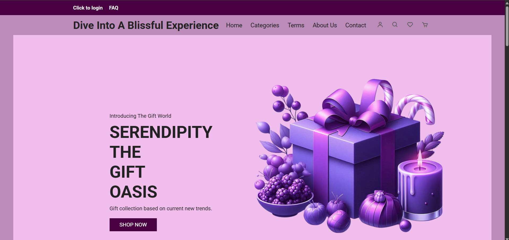
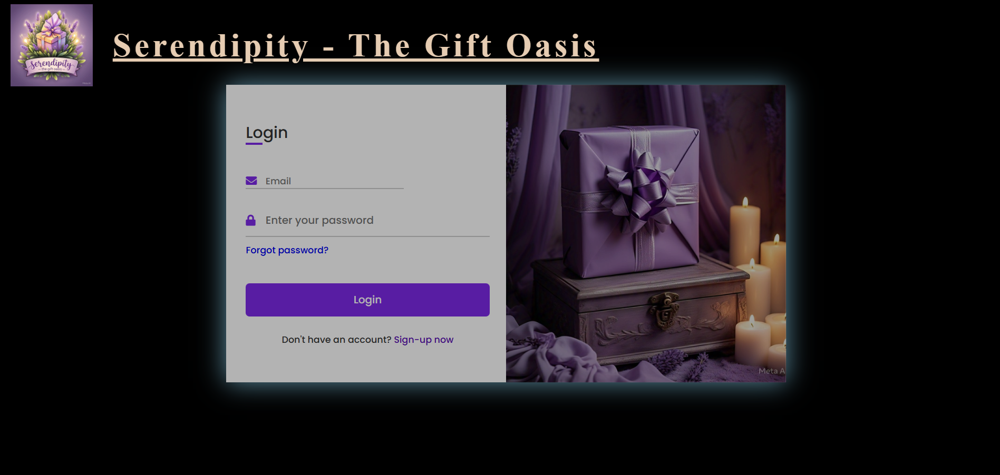
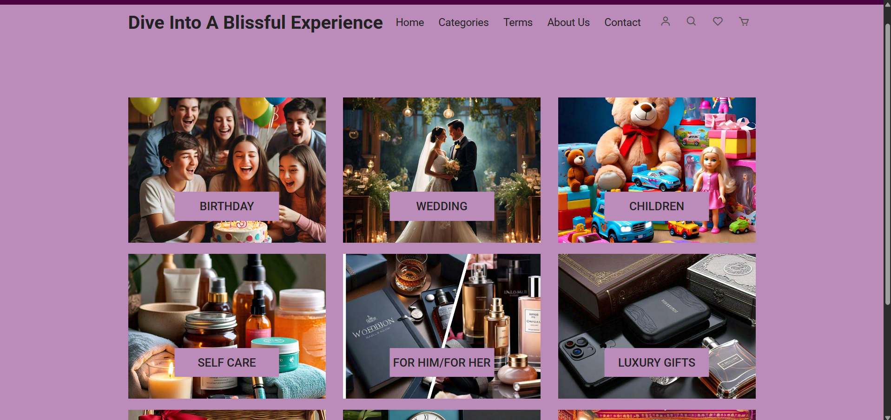
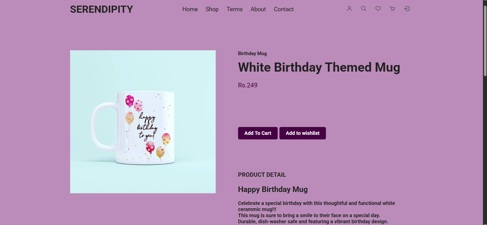
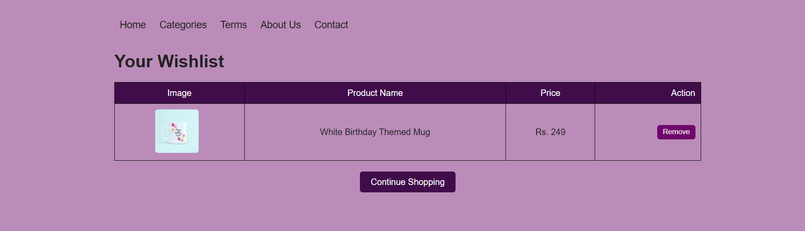
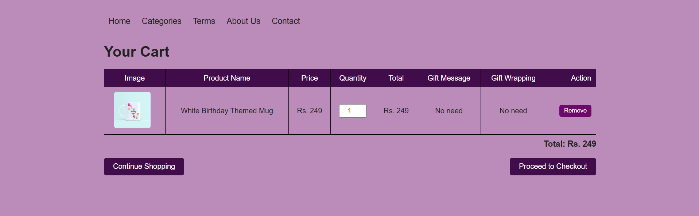
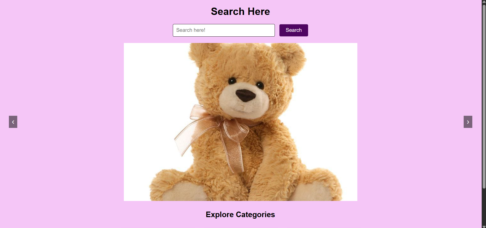
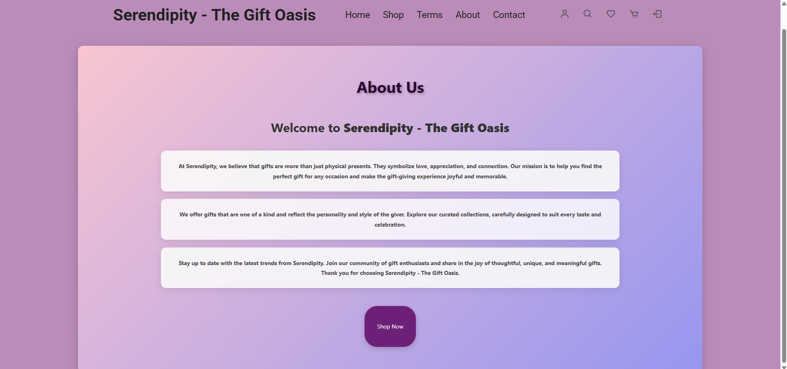
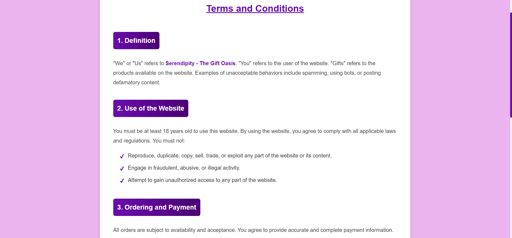

# 🎁 Serendipity – The Gift Oasis
Serendipity – The Gift Oasis is a complete e-commerce gift shopping website developed to provide users with an easy and enjoyable online gift-shopping experience.
The website allows users to browse different gift categories, view product details, search for products, add products to the cart and wishlist, select quantities, add gift messages, choose gift wrapping, and proceed to checkout.
---

# 📌 Project Overview
**Project Name:** Serendipity – The Gift Oasis
**Type:** E-Commerce Gift Shopping Website

**Frontend Technologies:**
- HTML
- CSS
- JavaScript

**Backend Technologies:**
- PHP

**Database:**
- MySQL / MySQLi

**Development Environment:**
- Visual Studio Code

**Local Server:**
- XAMPP
---

# ✨ Features
- Responsive Navigation Bar
- User Login and Logout
- User Registration
- Different Gift Categories
- Product Details Pages
- Product Image Zoom Effect
- Product Search Functionality
- Wishlist Functionality
- Shopping Cart
- Quantity Selection
- Gift Message Option
- Gift Wrapping Option
- Remove Items from Cart
- Remove Items from Wishlist
- Automatic Cart Total Calculation
- Checkout Order Summary
- Product Categories
- Related Products Section
- Responsive Website Design
- Database Connectivity using PHP and MySQL
- User Session Management
- Banner Slider
- Expandable Categories Section
---

# 🛍️ Gift Categories
The website contains multiple gift categories including:
- 🎂 Birthday Gifts
- 💍 Wedding Gifts
- 🧸 Gifts for Children
- 🧴 Self Care Gifts
- 👩 Gifts for Her
- 👨 Gifts for Him
- 💎 Luxury Gifts
- 🎁 Gift Hampers
- 🏠 Home Decor
- 🎉 Festival Gifts
---

# 🖼️ Website Screenshots
## 🏠 Home Page

---

## 🏠 Login/Register Page

---

## 🛍️ Categories Page

---

## 🎁 Product Details Page

---

## ❤️ Wishlist Page

---

## 🛒 Shopping Cart

---

## 🔍 Search Page

---

## 🏠 About US Page

---

## 🏠 Terms and Conditions Page

---

# 🛠️ Technologies Used
| Technology | Purpose |
|---|---|
| HTML | Structure of the website |
| CSS | Styling and layout |
| JavaScript | Client-side functionality |
| PHP | Backend functionality |
| MySQL | Database management |
| XAMPP | Local server environment |
| Visual Studio Code | Code editor and development environment |
---

# 📂 Project Structure

Serendipity-The-Gift-Oasis/
│
├── css/
│   └── styles.css
│
├── js/
│   ├── index.js
│   └── zoomsl.min.js
│
├── images/
│   └── Product and website images
│
├── screenshots/
│   ├── home.png
│   ├── categories.png
│   ├── product.png
│   ├── wishlist.png
│   ├── cart.png
│   └── search.png
│
├── index.php
├── categories.php
├── cart.php
├── wishlist.php
├── profile.php
├── login.php
├── logout.php
├── config.php
├── db_connect.php
│
└── README.md

### Steps to follow 
1.) Download XAMPP Control panel on your system. Link -- https://www.apachefriends.org/  
2.) Start APACHE server and MySQL module form the XAMPP control panel. 
3.) Click on the Admin button corresponding to MySQL. You will be redirected to localhost/phpmyadmin.  
4.) Now, create a new database named "ecommerce" under the database section.  
5.) Similarly, create a new table in your database named "users" and of 4 columns.  
6.) Set up the fields : id, username, password, created_at . Make id as auto increment.  
7.) Now Fork this project into "C:\xampp\htdocs" , i.e , wherever your XAMPP is located.  
8.) After all these setup, hit url "localhost/ecommerce" on a new tab in your browser to see the project running.  

### Project Collaborators ->
1.) Athulya Pradeepkumar --- https://github.com/athulya-p08   
2.) Siddhi Sasidharan ------- https://github.com/

📄 Disclaimer
This project was developed for educational and academic purposes.
The website is currently designed as an e-commerce project prototype and runs locally using XAMPP.
Some advanced production-level features such as a complete payment gateway, order tracking, and admin dashboard can be implemented as future enhancements.
